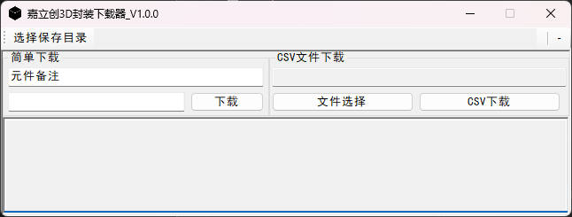

# README

## Intro

本项目为一个简单的爬虫工具，用于白嫖 jlc 的 3D 封装

## Use

工程基于 visual studio, 可以直接打开项目

## Other

+ 一些元件找不到3D封装
+ 爬取的某些元件的3D封装引脚数不对，要使用3D软件自行更改
+ 爬取的元件一般会有 jlc 的标志，若不喜欢，也可用3D软件自行更改

## Reference

- [warm_3dmodule](https://github.com/kulya97)